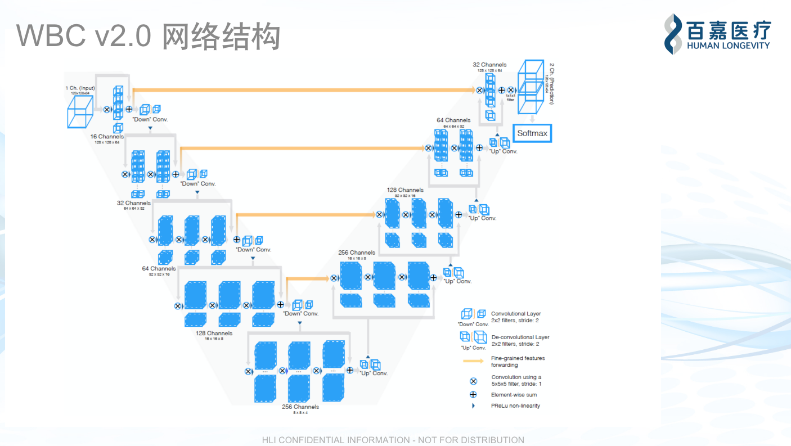

# hli-tool-whole-body-composition


DPL task name: hli_tool_whole_body_composition

REPO: hli-tool-whole-body-composition

Tool Description: HLI Whole Body Composition 

2 Machine learning models trained to label each pixel in a dicom as subcutaneous adipose tissue (SAT), visceral adipose 
tissue (VAT) or muscle. The pixel predictions are then added together to calculate the volume of each tissue type. 
The volumes are then used to create a biomarker which is then fed into downstream prediction models. 
This is meant as an eventual replacement to AMRA’s body composition report.

Prerequisites:
* Docker 
* EC2-Instance with a GPU (p2.xlarge)

Arguments:</br>
    main.py --working_dir <working_dir> --logging_dir <logging_dir> --output_dir <output_dir> --model_file <model_file>
    --input_dir <input_dir> --modality <modality> --range_file <range_file> 

main.py: Customized parameters inside the program </br>
    fat: 
    --slice_interval '120,360' 
    --resize_shape "240,256,320" 
    --num_classes 3 
    --slice_or_resize 'slice'
    </br>
    water: 
    --slice_interval '197,501' 
    --resize_shape "304,256,320" 
    --num_classes 2 
    --slice_or_resize 'slice'
    

## Examples for each Modality on linux:

### MUSCLE: </br>
```shell
    python3 hli-tool-whole-body-composition_torch/src/main.py \
    --sample_id HDAT18B5B27F \
    --working_dir working_dir \
    --logging_dir logging_dir \
    --output_dir output_dir \
    --model_file china_water_model_path \
    --input_dir china_water_dicom_path \
    --modality MUSCLE \
    --range_file range_file 
```
    
    
### FAT: </br>
```shell
    python3 hli-tool-whole-body-composition_torch/src/main.py \
    --sample_id HDAT18B5B27F \
    --working_dir working_dir \
    --logging_dir logging_dir \
    --output_dir output_dir \
    --model_file china_fat_model_path \
    --input_dir china_fat_dicom_path \
    --modality FAT \
    --range_file range_file 
```
    

### <create local images through ./Dockerfile>, generate docker image on linux and execute them through images:
```shell
     docker run hli-tool-whole-body-composition_torch_update:2.0.0 \
    --working_dir /tmp/working \
    --logging_dir /tmp/logging \
    --output_dir /tmp \
    --range_file s3://apollo8-datalake-nv-bj-prod-cn-northwest-1-prod/whole_body_composition/AMRA_NORMAL_RANGES.xlsx \
    --sample_id HDAT2AB21BEF \
    --input_dir s3://apollo8-datalake-nv-bj-prod-cn-northwest-1-prod/external/receive/P1/S3/imaging/HSUB59EED7D9/HORD4B2EEDE2/fat/ \
    --modality FAT \
    --model_file s3://apollo8-datalake-nv-bj-prod-cn-northwest-1-prod/whole_body_composition/new_version_models/cpu_epoch51_trainloss_0.070_validacc_0.942.pth
```
   

### docker pytest:
```shell
    docker run -it --entrypoint py.test <docker-images-name>hli-tool-whole-body-composition_torch_update:2.0.0 <test_code_path>/opt/project/tests/unit_tests 
```
    

# Upgrade Repository to latest BIX Standards:
1. Setup your NPM to point to Artifactory:
https://confluence.hli.io/display/OR/Artifactory+NPM+Repositories+Usage

2. Globally Install Yeoman Generator:
* ```sudo npm install -g yo```
* ```sudo npm install -g generator-standard-yeoman```

3. Globally install the BIX Tool Generator:
* ```sudo npm install -g generator-bix-tool```

4. Update local BIX Tool repo (backup or commit files prior to upgrade)
* ```yo bix-tool```

## algorithm directory describe：
```text
1、src: product task code
    1.1、interfaces: 
        run_job.py: fat and water preprocess、predict、postprocess 
    1.2、model: model struction
        1.2.1、vnet3d.py: VNet3D model 
        1.2.2、unet3d.py: UNet3D model 
    1.3、 predictions:
        pre_prediction_processor.py: data preprocess
        predictor_keras.py: Use the keras version of the model to predict
        predictor_torch.py: Use the torch version of the model to predict
        post_prediction_processor.py: Post processing after predict completion
    1.4、utils.py: 
    1.5、main.py: Execute the entire task process
2、train: train model
    2.1、torch_3dunet_data_preprocessing.py: Data preprocessing
    2.2、torch_3dunet_data_augmentation.py: Data augementation
    2.3、torch_vnet_float_parallel_water_full_size.py: train model（VNET）
    2.4、torch_vnet_float_parallel_full_size_test.py: model performance test: （VNET）
```

## test data relation

###1、test data path in American:</br>
```text
last_water_model_file = 's3://hli-anonymous-sdrad-pdx/wbc_test/model_1_version/water_production.h5'
last_fat_model_file = 's3://hli-anonymous-sdrad-pdx/wbc_test/model_1_version/test_save.h5'

water_model_file = 's3://hli-anonymous-sdrad-pdx/wbc_test/model_2_version/water_epoch35_trainloss_0.037_validacc_0.961.pth'
fat_model_file = 's3://hli-anonymous-sdrad-pdx/wbc_test/model_2_version/fat_epoch51_trainloss_0.070_validacc_0.942.pth'

water_input_dir = 's3://hli-anonymous-sdrad-pdx/wbc_test/test_dicom/water/'
fat_input_dir = 's3://hli-anonymous-sdrad-pdx/wbc_test/test_dicom/fat'

range_file = 's3://hli-anonymous-sdrad-pdx/wbc_test/AMRA_NORMAL_RANGES.xlsx'
```


###2、test data path in China </br>
```text
last_water_model_file = 's3://apollo8-datalake-nv-bj-prod-cn-northwest-1-prod/whole_body_composition/water_production.h5'
last_fat_model_file = 's3://apollo8-datalake-nv-bj-prod-cn-northwest-1-prod/whole_body_composition/test_save.h5'

water_model_file = 's3://apollo8-datalake-nv-bj-prod-cn-northwest-1-prod/whole_body_composition/wbc_2_verison/water_epoch35_trainloss_0.037_validacc_0.961.pth'
fat_model_file = 's3://apollo8-datalake-nv-bj-prod-cn-northwest-1-prod/whole_body_composition/wbc_2_verison/fat_epoch51_trainloss_0.070_validacc_0.942.pth'

water_input_dir = 's3://apollo8-datalake-nv-bj-prod-cn-northwest-1-prod/external/receive/P1/S3/imaging/HSUB21337B55/HORD05157BB1/water/'
fat_input_dir = 's3://apollo8-datalake-nv-bj-prod-cn-northwest-1-prod/external/receive/P1/S3/imaging/HSUB21337B55/HORD05157BB1/fat/'

range_file = 's3://apollo8-datalake-nv-bj-prod-cn-northwest-1-prod/whole_body_composition/AMRA_NORMAL_RANGES.xlsx'
```


